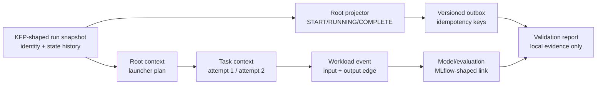

# Native KFP/RHOAI POC validation checkpoint

## Executive summary

[Observed] The local deterministic fixture passes four focused checks for the
proposed native lineage path: root lifecycle, task-context injection shape,
retry identity, and a workload-owned input/output edge with a model/evaluation
link. The result is written by `lineage-demo native-validation` and included in
the canonical `run-poc.sh` output as `native-path-validation.json`.

[Observed] A read-only observation of the installed RHOAI path confirms the KFP
root identity/state history, Data Registry asset, MLflow correlation, and
adapter-owned OpenLineage task edge. It also shows the decisive gap: the
completed task pod has the KFP launcher but no lineage context path, context
environment, context volume, or native `rhoaiKfp` facet. The compact sanitized
record is [`live-read-only-baseline-2026-09-30.json`](../examples/native-kfp-validation/live-read-only-baseline-2026-09-30.json).

[Proposed] The live result is **NO-GO for native support in the installed path**
and **GO for one narrowly scoped implementation spike**. It remains a NO-GO for
production adoption: the current RHOAI deployment has not been changed and
native control-plane production, supported launcher injection, and durable
outbox ownership remain unverified.

## Scope and non-goals

In scope:

- use the existing `rhoai-kfp:1.0` context, root-event, and outbox contracts;
- exercise the root lifecycle projection from KFP-shaped state history;
- validate the launcher-compatible context plan and safe runtime environment;
- prove that task attempts retain distinct child run IDs under one root;
- prove that the workload, not KFP, owns one observed data edge and model fact;
- produce a small, inspectable validation result for PM/architecture review.

Out of scope:

- deploying or modifying a KFP server, RHOAI operator, launcher, resolver, or
  lineage backend;
- writing cluster resources or changing Marquez, MLflow, or Data Registry state;
- asserting that a current RHOAI image emits native OpenLineage events;
- exact downstream image provenance, owner approval, or production qualification.

## Current implemented state

The checkpoint composes existing local primitives rather than introducing a
second contract:

| Concern | Local implementation | Evidence state |
| --- | --- | --- |
| KFP root identity and state mapping | `KFPRunSnapshot` + `KFPRootEventProjector` | [Observed] local fixture and tests |
| Context envelope and retry identity | `KFPLineageContext` | [Observed] schema validation and tests |
| Candidate launcher injection seam | `KFPLauncherContextPlan` | [Observed] local plan; native API [Unknown] |
| Workload event ownership | `task_event` with input/output datasets | [Observed] deterministic showcase event |
| Model/evaluation correlation | MLflow-shaped model link and evaluation facet | [Observed] deterministic showcase event |
| Integrated result | `native_validation.py` and `native-path-validation.json` | [Observed] four-check report |

The local validation is intentionally transport-neutral. It writes only a
sanitized report under the requested output directory and uses a non-routable
fixture resolver URL; no HTTP request is made. The live observation is a
separate read-only evidence path using temporary local port-forwards.

## Validation workflow



Question answered: **does the proposed contract connect orchestration,
context, workload ownership, and model outcome without making KFP own facts it
did not observe?**

Evidence baseline: local source and tests at the repository baseline recorded
in the metadata block, plus uncommitted fixture changes in this workspace. The
diagram represents the local fixture, not a deployed RHOAI topology.

Interpretation: the root projector supplies correlation and lifecycle; the
task event supplies the actual input/output edge; the model event supplies the
evaluation and model link. The contract remains useful only if those ownership
boundaries survive the eventual native transport.

## Four-check result

Run:

```bash
./scripts/run-native-path-validation.sh
cat build/native-validation/native-path-validation.json
```

The canonical POC also runs the same checkpoint:

```bash
./scripts/run-poc.sh
cat build/poc/native-path-validation.json
```

| ID | Check | Required result | Result |
| --- | --- | --- | --- |
| NATIVE-01 | Root lifecycle | One `START`, `RUNNING`, and `COMPLETE`; exact root run ID; three matching outbox records; no root data edges | [Observed] PASS in local fixture |
| NATIVE-02 | Task context injection | Direct task contexts validate against `rhoai-kfp:1.0`; parent is the exact root; launcher plan resolves by exact root ID and exposes only safe runtime values | [Observed] PASS in local fixture; native resolver API [Unknown] |
| NATIVE-03 | Retry identity | Attempt 1 fails, attempt 2 completes, child run IDs differ, and both retain the same root | [Observed] PASS in local fixture; native KFP retry observation [Unknown] |
| NATIVE-04 | Workload edge and model outcome | A training event owns input/output datasets and carries a candidate decision, metrics, and model link | [Observed] PASS in local fixture; first-party producer support [Unknown] |

The report recommendation is `GO_FOR_NARROW_NATIVE_SPIKE` when all four checks
pass. That recommendation is deliberately narrower than production readiness.

## Live vertical-slice observation

[Observed, 2026-09-30] The read-only importer queried one completed run in the
`scenario-b` DSPA on RHOAI `3.6.0-ea.1` / OpenShift `4.21.32`:

| Live seam | Observation | Result |
| --- | --- | --- |
| KFP root identity/lifecycle | Run `ad6efc7b-4b95-464e-b398-31df6b48e061`, pipeline/version IDs, `SUCCEEDED`, and `PENDING → RUNNING → SUCCEEDED` history | [Observed] PASS |
| Data Registry identity | Asset `33fbc314-ea15-4805-a958-95b8d29dd67d`, `scenario-b/forms/iso_form_extractions`, Parquet location | [Observed] PASS |
| MLflow outcome | Run `8856dadf381141d4a5009c63d5c749b3`, correlated by `kfp.root_run_id`, metrics and model/evaluation artifact directories | [Observed] PASS |
| OpenLineage event path | Four `START`/`COMPLETE` events for root/task; task `COMPLETE` has two inputs and one output; no native `rhoaiKfp` facet | [Observed] PARTIAL / adapter-owned |
| Task context injection | Launcher image and launcher runtime role observed; no context file/env/mount or `V2_LAUNCHER_COMMAND` override | [Observed] BLOCKED |
| Retry/delivery separation | No retry in this successful run; no native outbox observed; local projection was not sent to Marquez | [Unknown] NOT EXERCISED |

The installed API server image was
`registry.redhat.io/rhoai/odh-ml-pipelines-api-server-v2-rhel9@sha256:1c90ade8fa4e3d23929bbdb846e36d25d00bbbf6770fecad3785f04f0359570f`,
and the task pod used launcher image
`registry.redhat.io/rhoai/odh-ml-pipelines-launcher-rhel9@sha256:c9ffd6cf7adb887fe7859e23831a9c94280ffb050022576a14846314ee320b32`.
These are environment-specific observations, not a supported product promise.

## Go/no-go recommendation

### GO: one narrow native implementation spike [Proposed]

Use the observed RHOAI/KFP image baseline and implement only the smallest
vertical slice:

1. read the exact KFP run UUID, pipeline ID, version ID, state, and state
   history from the authoritative run API;
2. produce one native root lifecycle event through the supported control-plane
   seam;
3. inject one schema-valid, read-only task context into one workload;
4. emit one workload-owned input/output edge and one model/evaluation link; and
5. observe retry and delivery failure separately from workload outcome.

### NO-GO: current installed path as native support [Observed]

The installed path is not yet a native producer: the live Marquez events are
adapter-owned and the launcher seam does not currently expose the proposed
context injection contract.

### NO-GO: production adoption [Proposed]

Do not describe the result as native support or use it as a production gate
until the spike identifies and qualifies the supported launcher/context API,
control-plane owner, durable outbox, authorization path, exact image/source
baseline, and upgrade behavior.

## Evidence ledger

| Claim | Evidence state | Source and baseline | Verified | Caveat |
| --- | --- | --- | --- | --- |
| Root lifecycle projection maps KFP-shaped state history to OpenLineage root events | [Observed] | `src/lineage_demo/kfp_lineage.py`; `tests/test_kfp_lineage.py`; `native_validation.py` | 2026-09-30 | Local process model; no native KFP control-plane hook. |
| Context envelope preserves exact root and distinct task/retry identity | [Observed] | `contracts/rhoai-kfp-lineage-context-1.0.schema.json`; `KFPLineageContext`; focused tests | 2026-09-30 | Transport and resolver are not deployed. |
| Launcher plan resolves by exact root ID and excludes credentials | [Observed] | `src/lineage_demo/kfp_integration_readiness.py`; `tests/test_kfp_integration_readiness.py` | 2026-09-30 | Candidate seam only; supported RHOAI API [Unknown]. |
| Workload owns actual input/output edges | [Observed] | `src/lineage_demo/showcase.py`; generated product-demo events | 2026-09-30 | Fixture/workload evidence, not first-party platform emission. |
| Model/evaluation link is correlated to the producing task | [Observed] | `showcase.py` evaluation and model facets; `tests/test_showcase.py` | 2026-09-30 | MLflow-shaped local metadata, not live MLflow evidence. |
| Live RHOAI KFP run supplies root identity and state history | [Observed] | `examples/native-kfp-validation/live-read-only-baseline-2026-09-30.json`; read-only KFP API observation in `scenario-b` | 2026-09-30 | One environment-specific run; no native event producer implied. |
| Live RHOAI path correlates Data Registry, MLflow, and adapter-owned OpenLineage | [Observed] | Same sanitized baseline; live Data Registry/MLflow/Marquez queries through temporary local port-forwards | 2026-09-30 | Correlation is adapter-owned; Marquez events have no native `rhoaiKfp` facet. |
| Live launcher path injects the proposed lineage context | [Unknown] | Sanitized completed task pod and `ds-pipeline-dspa` deployment observation in the live baseline | 2026-09-30 | Launcher image is present, but no context file/env/mount or command override was observed. |
| Current RHOAI deployment supports the native producer path | [Unknown] | Live baseline plus existing qualification notes | 2026-09-30 | Native support is a current NO-GO; owner-approved implementation seam remains unresolved. |

## References

- [PM/architecture POC brief](pm-architecture-poc.md)
- [Native KFP context contract](native-kfp-lineage-context-contract.md)
- [Implementation-readiness ADR](adr-native-kfp-lineage-implementation-readiness.md)
- [Product demonstrator](product-demonstrator-v2.md)
