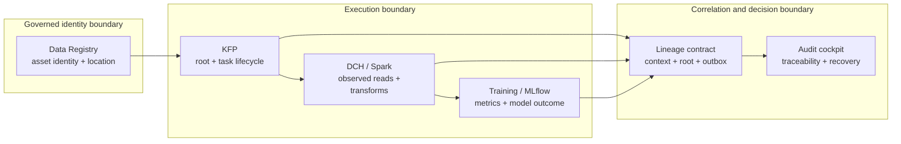

# PM / architecture lineage POC

Status: **[Proposed] stakeholder demonstration package**
Last updated: 2026-09-30
Evidence basis: deterministic local fixture, contract validation, and a bundled
sanitized read-only RHOAI snapshot.

## The goal

This is a **decision-ready demonstrator**, not a production hardening exercise.
Its job is to give project management and architecture a coherent answer to a
broader product question:

> Can a team discover which governed asset produced a model, understand the
> execution and evidence behind it, explain recovery when something fails, and
> decide what platform or product investment is justified?

The demonstrator is successful when a stakeholder can follow the user journeys
in 10–15 minutes, understand the trust and ownership boundaries, distinguish
observed behaviour from proposed capability, and leave with a bounded investment
decision. Native KFP support is one evidence point in that decision, not the
definition of the product.

## One command, one entry point

From `sample-app-best-practices`:

```bash
./scripts/run-poc.sh
open build/poc/poc-brief.html
```

The command is offline and deterministic. It creates one evidence pack from the
same validated payload:

- `poc-brief.html` — the PM/architecture narrative, decision request, ownership
  map, user journeys, capability matrix, architecture options, and
  POC-versus-production boundary;
- `cockpit.html` — the interactive success, failure/retry, evidence, and
  decision walkthrough;
- `decision-package.json` — the machine-readable stakeholder decision layer;
- `demo.json` — replayable scenarios and dossier data;
- `scenarios/` — event, context, and outbox payloads for inspection; and
- `verified-rhoai-run.json` — the sanitized read-only evidence snapshot used by
  the dossier.

The optional live-evidence path is deliberately separate and read-only:

```bash
./scripts/import-rhoai-evidence.sh
./scripts/run-poc.sh --verified-evidence build/product-demo/live-rhoai-evidence.json
```

The importer uses temporary API port-forwards and queries existing services. It
does not create, update, or delete cluster resources. The default POC does not
emit events to Marquez or mutate a shared backend.

## The 10–15 minute talk track

1. **Start with the product question.** Open the brief and ask which governed
   asset produced the candidate model.
2. **Show the happy path.** In the cockpit, select `Governed training succeeds`
   and follow `Data Registry → KFP root → feature preparation → candidate model`.
3. **Inspect the evidence.** Use Timeline and Dossier to show the root run,
   task attempts, data edges, evaluation metric, system evidence, and known gaps.
4. **Show why recovery matters.** Switch to `A failed attempt is retained and
   recovered`. Attempt 1 fails, attempt 2 succeeds, and a separate lineage
   delivery path reaches dead-letter status without changing the workload
   outcome.
5. **Close on the boundary.** Explain which facts are local fixture behaviour,
   which facts are verified by read-only RHOAI observation, and which facts need
   native platform support.
6. **Ask for a decision.** Compare the capability matrix and architecture
   options, then agree whether the bounded discovery scope is worth funding.

The local checkpoint behind that decision is documented in the
[native-path validation note](native-kfp-poc-validation.md). It is a four-check
fixture result, not native platform evidence.

### Native-path result [Observed]

The local checkpoint passes all four seams: root lifecycle, task-context
injection shape, retry identity, and one workload-owned input/output edge with a
model/evaluation link. The result is `PASS / OBSERVED_LOCAL_CONTRACT_FIXTURE`.

### Recommendation [Proposed]

Fund a bounded demonstrator-to-architecture discovery spike. Keep the
asset-to-model and recovery journeys as the product centre, use explicit
contracts and adapters where the platform boundary is not yet proven, and
qualify native KFP context/root production as one workstream. Do not treat the
local pass as native RHOAI support or as a production-readiness result.

### Installed-path observation [Observed]

The read-only vertical slice against RHOAI `3.6.0-ea.1` confirms the exact KFP
run identity and lifecycle, the governed Data Registry asset, a correlated
MLflow run with metrics/artifacts, and adapter-owned OpenLineage task edges.
The completed task pod includes the KFP launcher, but no proposed lineage
context file/env/mount or launcher command override was observed; the four live
Marquez events contain no native `rhoaiKfp` facet. See the
[sanitized live baseline](../examples/native-kfp-validation/live-read-only-baseline-2026-09-30.json).

### Updated native-support recommendation [Proposed]

The installed path is **NO-GO as native support**, but that does not invalidate
the broader product direction. It is **GO for bounded discovery** covering the
user journeys, ownership contracts, native context/root seam, durable delivery,
and architecture options. Production adoption remains NO-GO until the required
support, security, upgrade, and operational baselines are qualified.

## Architecture and ownership



Diagram question: **where does each fact originate, and where does trust cross
from governed identity into execution and then into the decision view?** The
Registry owns identity, KFP owns orchestration context, workloads own the edges
they observe, and the correlation layer must preserve those distinctions. The
diagram represents the local fixture plus the 2026-09-30 read-only baseline;
the native context producer and durable delivery path remain **[Unknown]** in
the inspected deployment.

| System | Owns in the POC | What it must not claim for another system |
| --- | --- | --- |
| Data Registry | Governed asset identity, metadata, and location reference | It does not copy the underlying data or prove immutable source bytes. |
| KFP | Root execution identity, lifecycle, task hierarchy, and retry context | It does not invent dataset edges, transformations, or model facts. |
| DCH / Spark | Physical reads, transformations, and derived dataset edges actually observed | It does not own the orchestration lifecycle. |
| Training / MLflow | Evaluation metrics, candidate decision, and model artefact link | It does not establish governed asset identity by itself. |
| Lineage platform | Correlation, replay, and an explainable cross-system view | It does not become the source of truth for facts it did not observe. |

This separation is the main architecture message: context makes the systems
correlatable; ownership keeps the resulting graph honest.

## Decision package

The generated `build/poc/decision-package.json` and cockpit **Decision** view
turn the evidence into a stakeholder decision layer. The three journeys are:

1. **Explain a governed model outcome [Observed].** Find the asset, follow the
   run, inspect workload-owned evidence, and explain the model result.
2. **Explain a recovered failure [Observed local fixture].** Keep the failed
   attempt, successful retry, and independent delivery dead-letter visible.
3. **Decide what to invest in [Observed evidence + Proposed options].** Compare
   capability states, trust boundaries, architecture options, and exit criteria.

### Capability matrix

| Capability | Current state | Owner | Decision impact |
| --- | --- | --- | --- |
| Governed asset identity | [Observed] | Data Registry | Retain the Registry as the governed starting point; do not copy data into lineage. |
| Run and task explanation | [Observed] read-only plus fixture | KFP / orchestration | Require a stable root identity and task hierarchy. |
| Workload-owned data edges | [Observed] adapter-owned | DCH / Spark / workload | Adapters report observed facts; the orchestrator does not invent them. |
| Model and evaluation explanation | [Observed] | Training / MLflow | Place model outcome beside lineage without collapsing identities. |
| Failure and recovery visibility | [Observed] local fixture | Orchestration + delivery | Treat recovery as product value, not a later operational add-on. |
| Native context and root producer | [Unknown] in inspected path | RHOAI/KFP platform | Qualify the platform seam before claiming native support. |
| Durable delivery and reconciliation | [Proposed] local model only | Lineage platform / operations | Give retry, replay, authorization, and support semantics an owner. |

### Architecture options and recommendation

| Option | Value | Trade-off | Recommendation |
| --- | --- | --- | --- |
| Native-first platform integration [Proposed] | Lowest adapter duplication if the platform owns context, root events, and delivery. | Depends on an unverified launcher/context seam and platform ownership. | Defer funding as the immediate implementation path. |
| Adapter-led vertical slice with explicit contracts [Proposed] | Fastest route to useful cross-system value while keeping ownership explicit. | Requires adapters and delivery operations, with migration risk if native support arrives. | Recommended bounded discovery path. |
| Lineage view only, defer collection [Proposed] | Smallest investment and platform dependency. | Does not reliably answer the governed asset-to-model or recovery questions. | Keep as fallback, not target direction. |

The investment recommendation is **[Proposed] `FUND_BOUNDED_DISCOVERY`**:
preserve the two user journeys, qualify one supported KFP/RHOAI context and root
path, define one workload adapter contract, exercise retry/delivery/replay and
authorization boundaries, and return with named owners and a go/no-go decision.
Production HA, scale, retention, broad engine coverage, and immutable-byte
claims remain explicitly deferred.

## What the POC proves

The following are **[Observed]** when `run-poc.sh` completes successfully:

- A governed asset can anchor an end-to-end data-to-model narrative.
- A versioned KFP-shaped context/root-event/outbox profile can correlate a root
  run with child task attempts and lifecycle events.
- Workload-owned input/output edges, evaluation metrics, and model links can be
  shown beside orchestration evidence without collapsing ownership.
- A failed task attempt, successful retry, and independent delivery dead-letter
  can be replayed and inspected rather than hidden behind a final status.
- The same facts can be reviewed as a PM brief, visual cockpit, decision
  package, JSON replay payload, and audit dossier.

The bundled live snapshot is **[Observed]** read-only evidence of a KFP run
identity, pipeline/version identity, and state history. It improves the
architecture conversation. The fresh observation also shows real Registry and
MLflow correlation, but it does not turn the adapter-owned events or local
fixture into a native platform integration.

## What remains outside the POC

The following are **[Unknown]** or **[Proposed]** production work, not reasons
to block this demonstration:

- native KFP lifecycle and task-context production in a supported RHOAI path;
- authoritative Data Registry revision and reproducibility semantics;
- exact downstream source/image provenance and immutable source-byte evidence;
- first-party DCH/Spark and MLflow adapters with supported ownership contracts;
- durable delivery, replay, reconciliation, retention, security, scale, and
  support operations; and
- owner sign-off, upgrade qualification, and release gates.

Those materials remain in this repository as a clearly labelled reference pack.
They are useful inputs to the next decision, but they are not the success
criterion for the PM/architecture POC.

## Decision and roadmap

The decision request is **[Proposed]**:

> Agree that governed asset-to-model traceability, including recovery
> visibility and evidence ownership, is a valuable cross-system capability and
> authorize bounded discovery across the user journeys, architecture options,
> native platform seam, and delivery model.

Suggested sequence:

1. **Align now [Observed / Proposed].** Use the offline pack to align on the
   product question, journeys, vocabulary, evidence labels, trust boundaries,
   and system ownership.
2. **Discover next [Proposed].** Qualify one supported KFP/RHOAI context and root
   path, one workload adapter contract, and retry/delivery/replay behavior in a
   disposable environment.
3. **Return with a decision [Proposed].** Use native observations, owner
   commitments, cost/risk, and exit criteria to choose native-first,
   adapter-led, or defer.
4. **Only then consider production [Unknown].** Treat HA, scale, retention,
   upgrade, security, and support qualification as a separate investment gate.

## Evidence ledger

| Claim | Evidence state | Source and baseline | Caveat |
| --- | --- | --- | --- |
| The happy path and recovery path are replayable | [Observed] | `src/lineage_demo/product_demo.py`, generated `build/poc/demo.json`, tests passing on 2026-09-30 | Deterministic local fixture; not production scale evidence. |
| The decision package exposes journeys, capabilities, boundaries, options, and exit criteria | [Observed] | `src/lineage_demo/decision_package.py`, generated `build/poc/decision-package.json`, 2026-09-30 | Recommendation is [Proposed], not an approved investment. |
| KFP run identity and lifecycle are present in the inspected RHOAI path | [Observed] | Sanitized `examples/native-kfp-validation/live-read-only-baseline-2026-09-30.json`, RHOAI 3.6.0-ea.1 / OpenShift 4.21.32 | One read-only environment and one run. |
| Native task context/root production is available in the inspected path | [Unknown] | Same live baseline; no context path/env/mount and no `rhoaiKfp` facet observed | Absence is a gap in the inspected deployment, not a universal release claim. |
| Bounded discovery is the recommended investment posture | [Proposed] | Decision package and this brief, verified 2026-09-30 | Requires PM, architecture, and owner agreement. |

## Reference material

- [Interactive product demonstrator](product-demonstrator-v2.md) — implementation
  detail for the cockpit and replay API.
- Generated [decision package](../build/poc/decision-package.json) — capability
  matrix, trust boundaries, architecture options, and exit criteria.
- [Product showcase](product-showcase.md) — the original governed asset-to-model
  stepping stone.
- [Native KFP context contract](native-kfp-lineage-context-contract.md) — the
  executable contract behind the POC payloads.
- [RHOAI/KFP qualification pack](rhoai-kfp-packaged-qualification.md) —
  production-readiness evidence and gates, intentionally kept as appendix.
